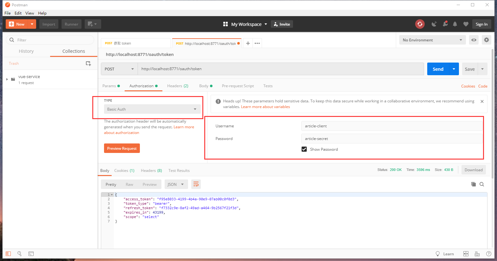
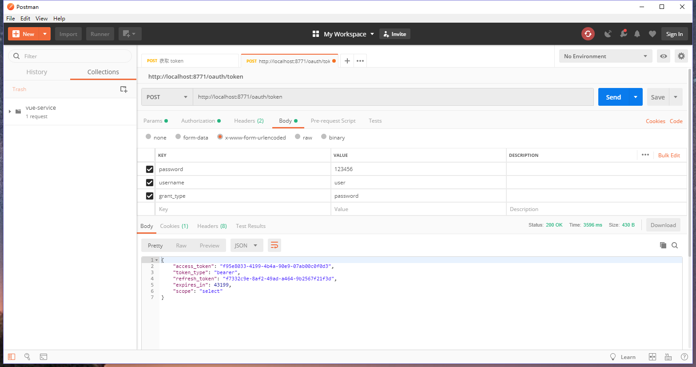

# article-service

#### 项目介绍
前端使用了react，后端使用springcloud, oauth2做统一认证

eureka
zuul
oauth2
storage

#### 软件架构
springcloud

#### 使用说明

1、依次启动 
eureka-service
zuul-service
oauth2-service
storage-service


>这两个模块测试使用，可以不用
elasticsearch-service
feign-service


2、导入登录账号导入数据，或者运行oauth2-service 中的Oauth2ServiceApplicationTests，导入登录账号和密码

INSERT INTO `react_article`.`user_info`(`id`, `create_date`, `lastmodified_time`, `password`, `type`, `username`) VALUES (1, '2019-06-01 17:37:22', '2019-06-01 17:37:22', '{bcrypt}$2a$10$B2XUurHGK7TBnuGB8NMIqOiPI33o4lqhRkbJQDQUt8OWkcYxcip4G', NULL, 'user');

3、获取token




部署：

java -jar xxx.jar --spring.profiles.active=dev >/log/app.log &


```
nohup java -jar eureka-service-0.0.1-SNAPSHOT.jar --spring.profiles.active=dev >log/eureka.log &
# nohup java -jar eureka-service-0.0.1-SNAPSHOT.jar --spring.profile.active=dev >log/eureka.log &


nohup java -jar oauth2-service-0.0.1-SNAPSHOT.jar --spring.profiles.active=dev >log/oauth2.log &
nohup java -jar storage-service-0.0.1-SNAPSHOT.jar --spring.profiles.active=dev >log/storage.log &
nohup java -jar zuul-service-0.0.1-SNAPSHOT.jar --spring.profiles.active=dev >log/zuul.log &


nohup java -jar eureka-service-0.0.1-SNAPSHOT.jar --spring.proflies.active=dev >log/eureka.log &
nohup java -jar oauth2-service-0.0.1-SNAPSHOT.jar --spring.proflies.active=dev >log/oauth2.log &
nohup java -jar storage-service-0.0.1-SNAPSHOT.jar --spring.proflies.active=dev >log/storage.log &
nohup java -jar zuul-service-0.0.1-SNAPSHOT.jar --spring.proflies.active=dev >log/zuul.log &


windows 乱码问题 要加上-Dfile.encoding=UTF-8
Java -Dfile.encoding=UTF-8  -jar xxx.jar --spring.profiles.active=dev >/log/app.log &
```

